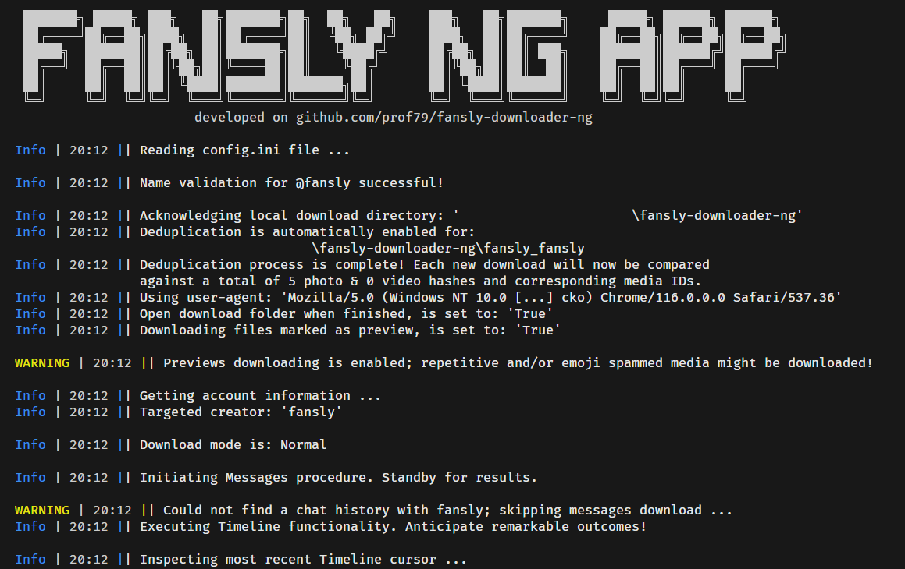

  <h1><code>Fansly Downloader NG</code>: The Ultimate Content Downloading Tool</h1>

  
  
  
  

  
  
  
  
  

This is a rewrite/refactoring of [Avnsx](https://github.com/Avnsx)'s original [Fansly Downloader](https://github.com/Avnsx/fansly-downloader). **Fansly Downloader NG** supports new features:

* Full command-line support for all options
* `config.ini` not required to start the program anymore - a `config.ini` with all program defaults will be generated automatically
* Support for minimal `config.ini` files - missing options will be added from program defaults automatically
* True multi-user support - put one or more creators as a list into `config.ini` (`username = creator1, creator2, creator3`) or supply via command-line
* Run it in non-interactive mode (`-ni`) without any user intervention - eg. when downloading while being away from the computer
* You may also run it in fully silent mode without the close prompt at the very end (`-ni -npox`) - eg. running **Fansly Downloader NG** from another script or from a scheduled task/cron job
* Logs all relevant messages (`Info`, `Warning`, `Error`, ...) of the last few sessions to `fansly_downloader_ng.log`. A history of 5 log files with a maximum size of 1 MiB will be preserved and can be deleted at your own discretion.
* Easier-to-extend, modern, modular and robust codebase
* It doesn't care about starring the repository

*There are still pieces missing like an appropriate wiki update.*

**Fansly Downloader NG** is the go-to app for all your bulk media downloading needs. Download photos, videos, audio or any other media from Fansly. This powerful tool has got you covered! Say goodbye to the hassle of individually downloading each piece of media – now you can download them all or just some in one go.

## ✨ Features

<table>
  <tr>
    <td align="middle" nowrap>
      <strong>📥 Download Modes</strong>
      

      <ul align="left">
        <li>Bulk: Timeline, Messages, Collection</li>
        <li>Single Posts by post ID</li>
      </ul>
    </td>
    <td align="middle" nowrap>
      <strong>♻️ Updates</strong>
      

      <ul align="left">
        <li>Easily update prior download folders</li>
        <li>App keeps itself up-to-date with fansly</li>
      </ul>
    </td>
    <td align="middle" nowrap>
      <strong>🖥️ Cross-Platform Compatibility</strong>
      

      <ul align="left">
        <li>Compatible with Windows, Linux & MacOS</li>
        <li>Executable app only ships for Windows</li>
      </ul>
    </td>
  </tr>
  <tr>
    <td align="middle" nowrap>
      <strong>⚙️ Customizability</strong>
      

      <ul align="left">
        <li>Separate media into sub-folders?</li>
        <li>Want to download previews?</li>
      </ul>
    </td>
    <td align="middle" nowrap>
      <strong>🔎 Deduplication</strong>
      

      <ul align="left">
        <li>Downloads only unique content</li>
        <li>resulting in less bandwidth usage</li>
      </ul>
    </td>
    <td align="middle" nowrap>
      <strong>💸 Free of Charge</strong>
      

      <ul align="left">
        <li>Open source, community driven project</li>
      </ul>
    </td>
  </tr>
</table>

[Configuration Settings in detail](https://github.com/prof79/fansly-downloader-ng/wiki/Explanation-of-provided-programs-&-their-functionality#explanation-of-configini)

[Detailed description on each of the components of this software](https://github.com/prof79/fansly-downloader-ng/wiki/Explanation-of-provided-programs-&-their-functionality)

## 📰 What's New (Release Notes)

### 0.7.3

This is a huge step - **Fansly Downloader NG** now has a binary download release for Windows and can be built automatically! 😁🎉

As a minor change, now also prints the program version number below the logo.

For more details and history see: **[Release Notes](ReleaseNotes.md)**

## 🏗️ Setup
On Windows you can just download and run the [executable version](https://github.com/prof79/fansly-downloader-ng/releases/latest) - skip the entire setup section and go directly to [Quick Start](https://github.com/prof79/fansly-downloader-ng#-quick-start).

#### Python Environment
If your operating system is not compatible with executable versions of **Fansly Downloader NG** (only Windows supported for ``.exe``) or you want to use the Python sources directly please [download and extract](https://github.com/prof79/fansly-downloader-ng/archive/refs/heads/master.zip) *or* clone the repository and ensure that [Python 3.11+](https://www.python.org/downloads/) is installed on your system.

**Note:** Using a [Python virtual environment](https://docs.python.org/3/library/venv.html) is recommended but out-of-scope of this guide.

Once Python is installed, you can then proceed by installing the required packages using [Python's package manager](https://realpython.com/what-is-pip/) ("`pip3`"/"`pip`") from your system's terminal:

    pip3 install -r requirements.txt

On Windows `pip3` is just called `pip`:

    pip install -r requirements.txt

Developers should also install `requirements-dev.txt`:

    pip3 install -r requirements-dev.txt

For Linux operating systems you may need to install the Python `Tkinter` module separately by using the command:

    sudo apt-get install python3-tk

On Windows and macOS the `Tkinter` module is typically included in the [Python installer itself](https://youtu.be/O2PzLeiBEuE?t=38).

After all requirements are met run `fansly_downloader_ng.py`.

Raw Python code versions of **Fansly Downloader NG** do not receive automatic updates. If an update is available you will be notified but need to manually download and set-up the [current repository](https://github.com/prof79/fansly-downloader-ng/archive/refs/heads/master.zip) again.

## 🚀 Quick Start
Follow these steps to quickly get started with either the [Python](https://github.com/prof79/fansly-downloader-ng#python-version-requirements) or the [Executable](https://github.com/prof79/fansly-downloader-ng/releases/latest):

1. Download the latest version of **Fansly Downloader NG** by choosing one of the options below:
   - [Windows exclusive executable version](https://github.com/prof79/fansly-downloader-ng/releases/latest) - `Fansly Downloader NG.exe`
   - [Python code version](https://github.com/prof79/fansly-downloader-ng#python-version-requirements) - `fansly_downloader_ng.py`

   and extract the files from the zip folder.

2. Ensure that you have recently logged into your Fansly account and accessed the Fansly website using one of the following web browsers: **Chrome, Firefox, Microsoft Edge, Brave, Opera, or Opera GX** on the operating systems **Windows 10/11, macOS or Linux**.

3. Open and run the ``Fansly Downloader NG.exe`` file by clicking on it or run `fansly_downloader_ng.py` from a terminal. This will initiate the interactive setup tutorial for the configuration file called [``config.ini``](https://github.com/prof79/fansly-downloader-ng/wiki/Explanation-of-provided-programs-&-their-functionality#explanation-of-configini).

4. After values for the targeted creators [Username](https://github.com/prof79/fansly-downloader-ng/blob/fc7c6734061f6b61ddf3ef3ae29618aedc21e052/config.ini#L2), your Fansly account [Authorization Token](https://github.com/prof79/fansly-downloader-ng/blob/fc7c6734061f6b61ddf3ef3ae29618aedc21e052/config.ini#L5) and your web browser's [User-Agent](https://github.com/prof79/fansly-downloader-ng/blob/fc7c6734061f6b61ddf3ef3ae29618aedc21e052/config.ini#L6) are filled you're good to go 🎉!
See the [manual set-up tutorial](https://github.com/prof79/fansly-downloader-ng/wiki/Get-Started) if anything could not be configured automatically.

Once you have completed the initial configuration of **Fansly Downloader NG**, for every future use case, you will only need to adapt the creator(s) in `Targeted Creator > Username` section in the `config.ini` using a text editor of your choice. Additional settings can also be found in the `config.ini` file, which are documented in [the Wiki](https://github.com/prof79/fansly-downloader-ng/wiki/Explanation-of-provided-programs-&-their-functionality#4-configini) page.

## 🤔 FAQ
Do you have any unanswered questions or want to know more about **Fansly Downloader NG**? Head over to the [Wiki](https://github.com/prof79/fansly-downloader-ng/wiki) or check if your topic was mentioned in [Discussions](https://github.com/prof79/fansly-downloader-ng/discussions) or [Issues](https://github.com/prof79/fansly-downloader-ng/issues)

* **Q**: "Is **Fansly Downloader NG** exclusive to Windows?"

* **A**: No, **Fansly Downloader NG** can be ran on Windows, MacOS or Linux. It's just that the executable version of the downloader, is currently only being distributed for the windows 10 & 11 operating systems. You can use **Fansly Downloader NG** from the [raw Python sources](https://github.com/prof79/fansly-downloader-ng#%EF%B8%8F-set-up) on any other operating system and it'll behave the exact same as the Windows executable version.

* **Q**: "Is it possible to download Fansly files on a mobile device?"

* **A**: Unfortunately, downloading Fansly files on a mobile device is currently not supported by **Fansly Downloader NG** or any other available means.

* **Q**: "Why do some executables show detections on them in VirusTotal?"

* **A**: The **Fansly Downloader NG** executables are not [digitally signed](https://www.digicert.com/signing/code-signing-certificates) as software certificates are very expensive. Thus the executables tend to produce a lot of false positives (invalid detections). Antivirus providers can be mailed to update their detections but not all do care.
If you're knowledgeable with the Python programming language you can decompile a [PyInstaller](https://github.com/pyinstaller/pyinstaller) executable such as **Fansly Downloader NG** using a tool like [uncompyle6](https://github.com/rocky/python-uncompyle6/) - and assure yourself that no harmful code is included. Or you could just create your own [PyInstaller](https://github.com/pyinstaller/pyinstaller) executable.

* **Q**: "Could you add X feature or do X change?"

* **A**: I'm regrettably very limited on time and thus primarily do stuff I find useful myself. You can contribute code by [opening a pull request](https://github.com/prof79/fansly-downloader-ng/pulls)

* **Q**: "Will you add any payment bypassing features to **Fansly Downloader NG**?"

* **A**: No, as the intention of this repository is not to harm Fansly or it's content creators.

+ **Q**: "Is there a possibility of being banned?"
**A**: While there are no guarantees, it's worth noting that among the 24.000+ previous users, there have been no reported incidents.

Please note that "Issue" tickets are reserved for reporting genuine or suspected bugs in the codebase of the downloader which require attention from the developer. They are not for general computer user problems.

## 🤝 Contributing to Fansly Downloader NG
Any kind of positive contribution is welcome! Please help the project improve by [opening a pull request](https://github.com/prof79/fansly-downloader-ng/pulls) with your suggested changes!

### Special Thanks
A heartfelt thank you goes out to [@liviaerxin](https://github.com/liviaerxin) for their invaluable contribution in providing the cross-platform package [plyvel](https://github.com/wbolster/plyvel). Due to [these builds](https://github.com/liviaerxin/plyvel/releases/latest) Fansly downloader NG's initial interactive cross-platform setup has become a reality.

## 🛡️ License
This project (including executables) is licensed under the GPL-3.0 License - see the [`LICENSE`](LICENSE) file for details.

## Disclaimer
"Fansly" or [fansly.com](https://fansly.com/) is operated by Select Media LLC as stated on their "Contact" page. This repository and the provided content in it isn't in any way affiliated with, sponsored by, or endorsed by Select Media LLC or "Fansly". The developer(referred to: "prof79" in the following) of this code is not responsible for the end users actions, no unlawful activities of any kind are being encouraged. Statements and processes described in this repository only represent best practice guidance aimed at fostering an effective software usage. The repository was written purely for educational purposes, in an entirely theoretical environment. Thus, any information is presented on the condition that the developer of this code shall not be held liable in no event to you or anyone else for any direct, special, incidental, indirect or consequential damages of any kind, or any damages whatsoever, including without limitation, loss of profit, loss of use, savings or revenue, or the claims of third parties, whether the developer has advised of the possibility of such loss, however caused and on any theory of liability, arising out of or in connection with the possession, use or performance of this software. The material embodied in this repository is supplied to you "as-is" and without warranty of any kind, express, implied or otherwise, including without limitation, any warranty of fitness. This code does not bypass any paywalls & no end user information is collected during usage. Finally it is important to note that this GitHub repository is the sole branch maintained and owned by the developer and any third-party websites or entities, that might refer to or be referred from it are in no way affiliated with Fansly Downloader, either directly or indirectly. This disclaimer is preliminary and is subject to revision.
